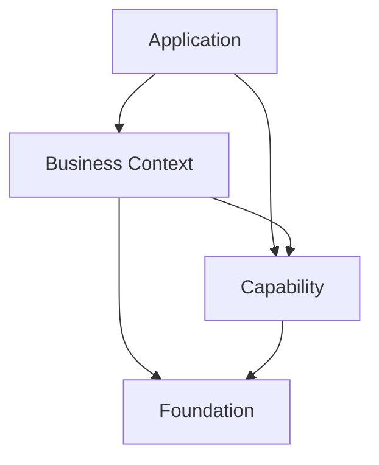

# 01 - Modèle cible

## Les quatre niveaux

| Niveau | Responsabilité | Exemples | Ne contient pas |
|---|---|---|---|
| Foundations | Primitives techniques communes et règles de plateforme | identité, tenant, policy, configuration, i18n, audit, observabilité, design system, app shell | règles métier d'un vertical |
| Capabilities | Fonctions réutilisables, indépendantes d'un métier | documents, fichiers, notifications, conversation, commentaires, workflow, approbation, impression, recherche, intégrations, IA | parcours ou vocabulaire Sektor |
| Business Contexts (BC) | Modèle, règles et expérience d'un domaine borné | Sektor BTP, Beauty, Layali | infrastructure transversale |
| Applications | Composition distribuable pour une audience | application Sektor, showroom Sandbox | logique métier copiée depuis les BC |

`optionnel` n'est pas un niveau. C'est la cardinalité d'une dépendance : un BC peut exiger `documents` et utiliser facultativement `approbation`.

## Frontières de code

Chaque module publie uniquement une surface explicitement marquée `api` ou `spi`.

```text
<module>/
  api/          # contrats consommables: DTO, ports, événements, types web publics
  spi/          # extensions qu'un fournisseur externe peut implémenter
  internal/     # implémentation non importable hors module
  i18n/         # packs de traductions du module
  manifest.ts   # contrat déclaratif du module
```

Un consommateur ne dépend jamais de `internal/`, d'une table de base de données appartenant à un autre module, ni d'une route non documentée. Toute nouvelle dépendance inter-module passe par une API, un événement ou une SPI versionnée.

## Dépendances autorisées



- Une Foundation ne dépend ni d'une capability ni d'un BC.
- Une capability ne dépend jamais d'un BC.
- Un BC ne dépend jamais d'un autre BC par ses internes. Une interaction devient un contrat explicite, un événement ou une capability réellement commune.
- Les cycles sont interdits, même si le langage ou le bundler les tolère.

## Ownership et exploitation

Chaque module possède un identifiant stable, un owner et un cycle de vie. Le manifest sert à produire un catalogue et à valider la composition; il ne sert pas à autoriser un utilisateur.

Les opérations et événements sont instrumentés avec, lorsqu'ils sont pertinents :

```text
nafura.app.id
nafura.bc.id
nafura.capability.id
nafura.tenant.id
nafura.operation
```

Les identifiants techniques sont stables et non localisés. Les libellés vus par l'utilisateur viennent des packs i18n.

## Décisions négatives

- Pas de micro-frontends dans cette phase.
- Pas de chargement de modules à chaud.
- Pas de service séparé uniquement parce qu'un dossier est devenu gros.
- Pas de catalogue de rôles BTP, de seeds BTP ou de vocabulaire ERP dans une Foundation ou une capability générique.
