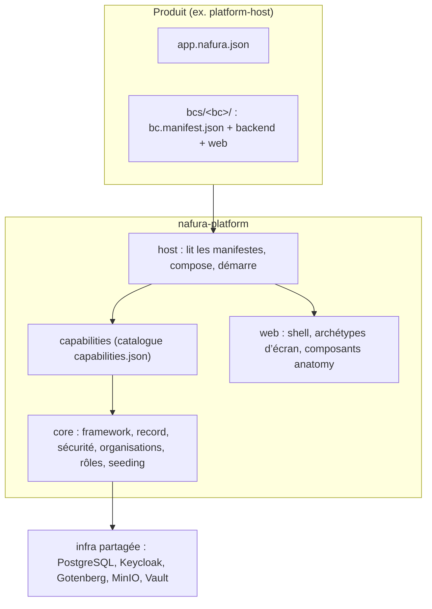

# Architecture Nafura

> Cible et état réel. Un écart entre ce document et le code est un bug de l’un des deux.

## En une phrase

**Un produit Nafura = un `app.nafura.json` + des BCs.** La plateforme fournit tout le reste (connexion, organisations, rôles, administration, réglages, shell, documents, IA, ops). Un fichier produit qui n’est ni de la configuration ni du code métier de BC est un manque de la plateforme.

## Le dépôt

| Dossier | Rôle |
|---|---|
| `nafura-platform/` | La plateforme : `sources/backend` (Spring Boot, modules Gradle), `sources/web` (Angular, bibliothèques), `ops/` (déploiement commun), `scripts/`, `capabilities.json`, `stack.versions.properties`. |
| `platform-host/` | Le produit de référence : `app.nafura.json`, points d’entrée, `bcs/demo`. Tout nouveau produit en est une copie. |
| `sandbox/` | Vitrine des composants UI (legacy, connexion lab propre). |
| `sektor/` | ERP BTP. **Ancienne architecture** (`socle` = plateforme-bis dans le produit) ; sera reconstruit sur le host (`sektor-sur-host`). Ne pas le prendre pour modèle. |
| `venue-catalog/`, `mbs-studio/`, `corporate/` | Autres produits et vitrines, hors host pour l’instant. |
| `raster/` | Outil de pilotage (en pause). |
| `deps/` | JDK et Node du projet (versions de `stack.versions.properties`). |

## Couches



- **Core** (toujours présent) : `cap.foundation` (framework, record, multi-tenant, observabilité, settings), `cap.lab` (runtime du host : manifeste, organisation, seeding, mode lab), `cap.access` (rôles et permissions).
- **Capabilities** : tout le reste (`iam`, `approvals`, `documents`, `notifications`, `ai`, …). Le host les embarque **toutes**, testées ensemble ; un produit en retire par `spec.capabilities.disabled`. Il n’en ajoute jamais. État livré et roadmap par cap : [docs/capabilities/](capabilities/00-README.md).
- **BC** (business context) : le métier d’un produit. Il dépend des API publiques de la plateforme, jamais d’un autre BC ni de Sektor.

## Un produit

```
<produit>/
  app.nafura.json          identité, runtime, rôles composés, ports et utilisateurs lab, déploiement
  bcs/<bc>/
    bc.manifest.json       permissions, rôles par défaut, navigation, libellé, icône, routesPrefix
    backend/               entités, RecordController, cycles de vie JSON, migrations SQL, jeux de données
    web/                   configurations d’écrans (ListingPageConfig, RecordPageConfig) ; export default
  sources/{backend,web}/   points d’entrée : identiques octet pour octet à platform-host (garde-fou)
  ops/run.mjs              appelle le lanceur commun ; ops/k8s/<env>/ : patches propres au produit
```

Le nom du produit n’existe que dans `app.nafura.json`. Le backend le lit au démarrage, Gradle et le web au build. Création : `node nafura-platform/scripts/nafura.mjs new <id> --name "<Nom>"`.

## Règles d’architecture (décisions)

1. **Configurer, pas coder.** Un BC déclare ; la plateforme lit. Pas de générateur qui copie du code dans le produit.
2. **Une seule implémentation par besoin.** Un besoin générique remonte dans la plateforme une fois, sous un seul artefact (une liste, une fiche, une sidebar, un mécanisme de rôles). Jamais de copie dans un produit.
3. **Permissions, jamais de rôles dans le code.** Un BC déclare ses permissions (`<bc>.<feature>.<ressource>.<action>`) et des rôles par défaut ; le produit compose des rôles transverses ; l’organisation crée les siens. Aucune permission implicite.
4. **Mêmes migrations partout.** Le changelog est généré depuis les modules composés ; le lab l’applique et valide les entités ; staging et prod le passent par un Job avant le déploiement.
5. **La connexion appartient à l’environnement** : lab = sélecteur d’utilisateurs sans mot de passe (interdit en prod) ; ailleurs = Keycloak partagé, un client par produit, jeton vérifié (émetteur, signature, destinataire).
6. **Organisation** : `spec.runtime.tenancy: single` (une organisation par déploiement, créée par la plateforme, propriétaires `spec.deploy.<env>.owners`) ou `multi` (plusieurs organisations, opérateur `spec.deploy.<env>.operators`). La permission `platform.operator.*` ne vient que de cette liste : les jokers de rôle ne la couvrent jamais, et un rôle qui la déclare empêche le démarrage. `spec.runtime.signup` vaut `operator` (défaut) ou `open`.
7. **Données initiales = fichiers du BC**, appliqués à chaque organisation à travers les règles des records (validation, cycle de vie), idempotents. Portée `organization` (défaut, une copie par organisation) ou `product` (un jeu, lecture seule pour les organisations, entités `ProductEntity`).
8. **Audiences** : un compte, plusieurs audiences. L’audience est un attribut de l’appartenance (`members` par défaut). Une audience externe ne voit que les records dont le champ `@OwnedBy` est cet utilisateur ; sans annotation, elle ne voit rien. On ne retombe jamais sur `createdBy`.
9. **Portées des données** : une entité de BC (`ma.nafura.bc`) étend `TenantEntity` (organisation), `OwnedEntity` (personne) ou `ProductEntity` (produit). Un partage se déclare par `@SharesWith` sur l’entité de liaison, champs explicites, recensé au démarrage.
10. **Un écran = un archétype configuré** (liste, fiche, arbre, assistant, étapes). Voir [UI.md](UI.md).
11. **Le BC démo exerce toute la plateforme.** Chaque concept et artefact (archétypes et leurs variantes, cycle de vie, approbation, seeding, permissions, capabilities) y a un cas d’usage : c’est sa vitrine et son banc de test. Un concept absent de la démo n’est ni montré ni testé.
12. **Statut et étapes, au choix du BC** : un parcours en étapes peut être une vue du cycle de vie (étapes = groupes d’états) ou un avancement déduit des données, indépendant du statut ; dans les deux cas, un seul statut stocké par record, et la complétude des étapes peut conditionner une transition.
13. **Lab mode** : aucun produit n’a encore de données métier en prod (sauf vitrines MBS et corporate). Schéma cible net, pas de migrations défensives.

## Environnements

| Mode | Où | Base | Connexion | Données de démo |
|---|---|---|---|---|
| `lab` | poste | PostgreSQL embarqué | utilisateurs lab | oui |
| `local-staging` | poste | PostgreSQL du staging | sélecteur d’utilisateurs lab | oui |
| `staging` | Docker Desktop k8s | infra `nafura-infra-staging` | Keycloak staging | oui |
| `prod` | VPS OVH k3s | infra `nafura-infra-prod` | Keycloak prod | jamais |

Lancement : [ops/README.md](../ops/README.md).

## État et écarts

| Sujet | État |
|---|---|
| Host, manifestes, capabilities, BC démo, rôles, connexion, seeding | livrés (`platform-host`) |
| Notifications : événements déclarés (BC et plateforme), routeur unique, préférences organisation / utilisateur (API), canaux in-app et e-mail | livré (backend) |
| Notifications : écrans de préférences, canal SMS, modèles de message par canal | à faire |
| Tenancy `multi` : organisations, opérateur, sélecteur, isolation (démo) | livré (API et sélecteur) ; console opérateur (écrans) à faire |
| Pages publiques : catalogue agrégé `@PublicEndpoint` + `@PublicField` | livré (API) ; coquille `/p/{slug}`, dépôt et limite de débit à faire |
| Audience externe : attribut d’appartenance, `@OwnedBy` | livré (filtre) ; effacement et lien e-mail à faire |
| Données hors organisation : `@SharesWith`, portée de seed `product` | livré (garde-fous) ; consentement et écriture du seed produit à faire |
| Listes : descripteur du record (`records/*.json`), `/properties`, grammaire de filtre avec relations à un saut, `/aggregate`, vues (table, kanban, calendrier, arbre), filtres proposés | livré |
| Écrans d’administration sur l’archétype du host : clés d’API, webhooks | livré (records) |
| Écrans d’administration encore hors archétype : séquences (`LegacyListingPageComponent`), 7 écrans sur `ConfigDrivenListingPage` (`lib/anatomy` `ListingPageConfig`) | à migrer ([spec 01](../specs/revue-plateforme/01-liste-unique.md)) |
| Approbation par permission (au lieu d’un rôle), multi-étapes, historique | à faire |
| Réglages déclarés par BC, documents (impression, marque, import), conversation IA, tableau de bord | à faire |
| i18n par BC (libellés du BC démo en dur) | à faire |
| BC démo couvrant chaque concept et artefact (règle 9) ; étapes déduites des données et conditions de transition calculées (règle 10) | à faire |
| Écrans spécifiques d’un BC ([UI.md](UI.md)) : `spec.screens`, `ScreenPageComponent`, façade `screen-kit`, garde-fou | livré (démo : synthèse fournisseur) |
| Sektor sur le host (supprimer `socle`, vérifications de rôles `OWNER`) | à faire |
| Publication (BOM Maven, paquets npm) à la place de `includeBuild` et des alias source | après Sektor |
| `platform/lab-auth` : seulement pour `sandbox` | à migrer |

Feuille de route : [ROADMAP.md](../ROADMAP.md).
