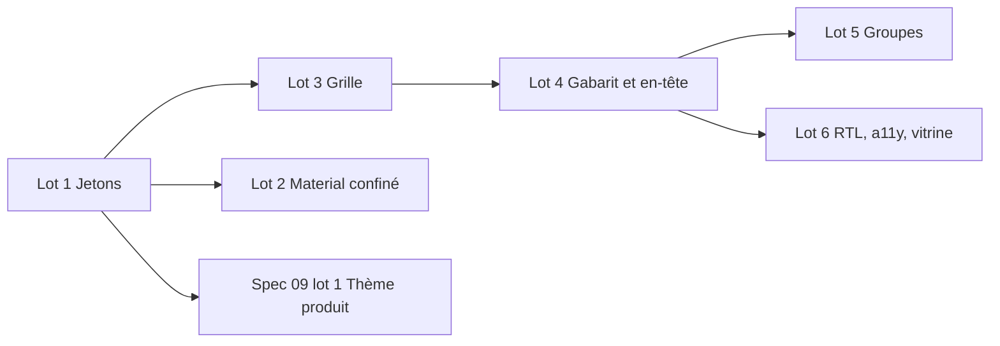

# 11 — Formulaires et design system

> Revue 2026-10-08, axes homogénéité et UX. Taille **L** (front), six lots livrables séparément.
> Prérequis du lot 1 de la spec [09](09-marque-et-libelles-produit.md) : sans jetons uniques, un thème produit ne s'appliquerait qu'à moitié.
> Recoupe [01](01-liste-unique.md) et [02](02-fiche-unique.md) (écrans d'administration qui importent encore Material) et [04](04-heritage-sektor.md) (jetons propres à Sektor).

## Objectif

1. Une fiche se met en page **uniquement par configuration** : colonnes, largeur d'un champ, retour à la ligne, groupes, section repliable. Un BC n'écrit aucun style.
2. Tous les champs ont **le même gabarit** (libellé, contrôle, message), alignés sur une grille qui se replie en trois paliers selon la largeur disponible.
3. Le rendu ne dépend que de **jetons `--nf-*` en trois niveaux**. Changer un jeton sémantique change toute l'application, composants Material compris. C'est la condition du thème produit (spec 09) et d'un éventuel changement de bibliothèque de composants.

## État des lieux (mesuré le 2026-10-08)

### Formulaires

| Sujet | Constat | Où |
|---|---|---|
| Colonnes | `RecordSection.columns: 1 \| 2` (défaut 2). `nf-form` accepte `columns: number` et `layout: 'vertical' \| 'horizontal' \| 'grid'`, mais la fiche n'utilise que `grid`. | `record-page.types.ts`, `form.component.ts` |
| Largeur d'un champ | `RecordField.wide` ; `FormFieldConfig.colSpan` existe sans être documenté, et `wide` passe par-dessus. `textarea` et `richtext` prennent toujours toute la ligne. | `record-page.component.ts` (`sectionView`) |
| Utilisateurs de `wide` | BC démo : `projects.ts` (richtext, donc redondant), `purchase-requests.ts`, `suppliers.ts` ; plateforme : `roles.record.ts` (textarea, redondant). | |
| Repli | Un seul seuil : container query à 640 px, tout passe sur une colonne. | `form.component.ts` |
| Groupes | Une section = une carte (`title`, `description`). Rien à l'intérieur d'une section. | |
| Gabarits de champ | Deux familles : `mat-form-field` outline à libellé flottant (texte, nombre, date, liste) et atomes `nf-*` à libellé au-dessus (`money`, `ice`, `rib`, `phone-ma`, `city-ma`). Hauteurs et libellés différents. | `form.component.ts` |
| Champ obligatoire vide | Le libellé reste en position de placeholder (« Unité* ») alors qu'un champ rempli l'affiche en flottant. | |
| Booléen | `mat-checkbox` nue dans une cellule prévue pour un champ de 56 px : désalignée. | |
| Lecture | Fiche verrouillée = champs désactivés. | |
| En-tête de fiche | Statut et actions sur une ligne à part, sous l'en-tête : le menu « … » se retrouve seul. `nf-screen` projette pourtant `[actions]` dans `nf-page-header`. | `record-page.component.ts` |
| Consommateurs de `nf-form` | `nf-record-page`, `nf-form-dialog` (2 colonnes au-delà de 6 champs), `nf-modal`, `nf-address-form`. | |

### Design system

| Sujet | Constat |
|---|---|
| Sources de jetons | Trois : `core/styles/*` (`--nf-*`), `lib/anatomy/styles/tokens.scss` (« Anatomy ERP — BTP Maroc ») et `lib/design-system/` (« Doxura Design System v1 », `--dox-*`, composants `dox-status-chip` et `dox-context-header`). |
| Jetons Doxura | 281 usages de `--dox-*`, dont 250 dans `app/document-extraction`. |
| Deux familles sémantiques | Courte : `--nf-text-muted` (141 usages), `--nf-border-default` (231), `--nf-primary` (136)… Longue : `--nf-color-text*`, `--nf-color-border*`, `--nf-color-surface*`, `--nf-color-bg*` (314 usages). Le mode sombre redéfinit les deux. La famille longue partage son préfixe avec les primitifs (`--nf-color-gray-500`). |
| Deux échelles typographiques | `core/styles/_typography.scss` (`--nf-font-size-sm: 0.875rem`, `base: 1rem`) et `tokens.scss` (`sm: 0.8125rem`, `base: 0.875rem`). La valeur qui gagne dépend de l'ordre de chargement. `--nf-text-xs…3xl` (taille, 18 usages) entre en collision de nom avec `--nf-text-muted` (couleur). |
| Couleurs du thème d'organisation | `ThemeService` n'écrit que `--nf-color-primary` (+ `light`, `dark`, `contrast`). Les tons dérivés (`--nf-surface-selected: var(--nf-color-primary-100)`, `--nf-primary-subtle`) lisent la palette statique et ne suivent pas la couleur de l'organisation. |
| Thème Material | `prebuilt-themes/indigo-pink.css` importé par `platform-host` et `sandbox` : case à cocher rose. Surcharges `--mdc-checkbox-*` dans `_host-global.scss`, probablement sans effet avec Material 22. `lib/design-system/material-theme.scss` en API M2, non importé. |
| Material hors de `lib/anatomy` | 17 fichiers : `platform/host/provide-nafura-host.ts` ; `core/components/confirm-dialog/*` (2), `core/i18n/fr-mat-paginator-intl.ts` ; `features/` (13 : dialogues des modèles d'e-mail, des rôles, des approbations, de l'audit ; sections des réglages application et utilisateur ; `approvals.page.ts`, `audit-timeline.component.ts`). Aucun dans les BCs. |
| Couleurs en dur | 153 fichiers de `lib`, `core`, `platform` et `features` contiennent un hex (surtout en repli `var(--x, #hex)`), dont 66 composants de `lib/anatomy`. `nf-form` : `#dc2626`, `#666`, `#64748b`. |
| Primitifs lus par des composants | 18 composants de `lib/anatomy` lisent `--nf-color-gray-*` ou `--nf-color-primary-<n>`. |
| RTL | 134 propriétés physiques (`margin-left`, `right:`…) contre 42 logiques. |
| Vérification visuelle | Pas de Playwright dans la plateforme (seulement dans Sektor) ; `check` ne lance rien. |
| Sektor | `sektor/sources/web/src/styles.scss` importe `lib/anatomy/styles/tokens.scss`. Les jetons de statut, de montant et de chantier de ce fichier ne sont utilisés par aucun écran de la plateforme. |

## Principes retenus

1. **Jetons en trois niveaux** : primitif → sémantique → composant. Un composant ne lit jamais un primitif. Thème, mode sombre et densité ne redéfinissent que des sémantiques ou des jetons de composant.
2. **Une bibliothèque de composants, derrière les atomes `nf-*`.** Material n'apparaît que dans `lib/anatomy`.
3. **Mise en page par configuration.** La fiche décrit une intention (colonnes, largeur, groupe), le composant décide du rendu.
4. **Container queries.** Un formulaire s'adapte à la largeur de son conteneur (carte, dialogue, panneau), pas à celle de l'écran.
5. **Accessibilité WCAG 2.2 AA et propriétés logiques** dans tout ce qui est touché.
6. **Cliquet** : chaque garde-fou interdit d'aggraver la dette dès le lot 1 ; la dette existante est listée dans le test et diminue lot après lot.

## Contrat

### Lot 1 — Jetons

#### 1.1 Une seule source, trois niveaux

Tout est dans `core/styles/`. Nommage :

| Niveau | Forme | Exemples |
|---|---|---|
| Primitif | `--nf-color-<palette>-<50…950>`, `--nf-space-<n>`, `--nf-radius-<sm\|md\|lg\|xl\|full>`, `--nf-font-size-<xs…4xl>`, `--nf-line-height-*`, `--nf-font-family-<sans\|mono>` | `--nf-color-gray-500`, `--nf-space-4` |
| Sémantique | `--nf-<rôle>[-<variante>]`, sans `color-` | `--nf-surface-page`, `--nf-surface-section`, `--nf-surface-raised`, `--nf-surface-hover`, `--nf-surface-selected`, `--nf-surface-muted` ; `--nf-text-primary`, `-secondary`, `-muted`, `-disabled`, `-inverse`, `-link` ; `--nf-border-default`, `-subtle`, `-strong`, `-focus` ; `--nf-primary`, `--nf-accent`, `--nf-danger`, `--nf-success`, `--nf-warning`, `--nf-info`, `--nf-neutral`, chacun avec `-hover`, `-active`, `-subtle`, `-contrast` ; `--nf-focus-ring` ; `--nf-radius-control`, `--nf-radius-card` ; `--nf-font-family` |
| Composant | `--nf-<composant>-<propriété>` | `--nf-field-height`, `--nf-button-padding-x-md`, `--nf-sidebar-item-padding` |

- La famille sémantique **courte** est conservée (la plus utilisée, et distincte des primitifs). La famille longue (`--nf-color-text*`, `--nf-color-border*`, `--nf-color-surface*`, `--nf-color-bg*`, 314 usages) est remplacée mécaniquement, puis supprimée.
- Une seule échelle typographique : `--nf-font-size-*` dans `_typography.scss`, avec les valeurs **effectivement appliquées aujourd'hui** (à relever dans le navigateur avant fusion, pour ne rien changer visuellement). `--nf-text-<taille>` (18 usages) est remplacé par `--nf-font-size-<taille>`.
- Entrées de marque : `ThemeService` n'écrit plus que `--nf-brand-primary` et `--nf-brand-accent`. Les variantes sémantiques en dérivent en CSS, en clair comme en sombre :

  ```scss
  --nf-primary: var(--nf-brand-primary, var(--nf-color-primary-600));
  --nf-primary-hover: color-mix(in oklch, var(--nf-primary) 88%, black);
  --nf-primary-subtle: color-mix(in oklch, var(--nf-primary) 10%, var(--nf-surface-section));
  ```

  `--nf-primary-contrast` reste calculé par `ThemeService` (`contrastText`), car CSS ne sait pas encore choisir une couleur de texte selon le fond.
- `.nf-theme-dark` ne redéfinit que des sémantiques.
- Suppressions :
  - `lib/anatomy/styles/tokens.scss` : ce qui n'est utilisé que par Sektor (statuts, montants, chantiers, `.filter-tabs`, `.erp-toolbar`) part dans `sektor/sources/web/src/` ; l'import de `styles.scss` de Sektor est modifié en conséquence ;
  - `lib/design-system/` (Doxura) : les `--dox-*` sont remplacés par les sémantiques `--nf-*`, `dox-status-chip` par `nf-status-badge`, `dox-context-header` par `nf-page-header` ;
  - `lib/design-system/material-theme.scss`.

#### 1.2 Thème Material

- Un fichier `platform/host/_material.scss`, inclus par `_host-global.scss` : `mat.theme(...)` (M3), puis les jetons système `--mat-sys-*` définis à partir des sémantiques :

  | Jeton Material | Jeton Nafura |
  |---|---|
  | `--mat-sys-primary`, `--mat-sys-on-primary` | `--nf-primary`, `--nf-primary-contrast` |
  | `--mat-sys-secondary`, `--mat-sys-tertiary` | `--nf-accent` |
  | `--mat-sys-error` | `--nf-danger` |
  | `--mat-sys-surface*`, `--mat-sys-on-surface*` | `--nf-surface-*`, `--nf-text-*` |
  | `--mat-sys-outline`, `--mat-sys-outline-variant` | `--nf-border-strong`, `--nf-border-default` |
  | `--mat-sys-corner-*` | `--nf-radius-*` |
  | polices `--mat-sys-*-font` | `--nf-font-family` |

- Une surcharge propre à un composant (`mat.<composant>-overrides`) n'est utilisée que si le jeton système ne suffit pas (hauteur de champ, par exemple).
- Retraits : la ligne `prebuilt-themes/indigo-pink.css` de `platform-host` et `sandbox`, et les blocs `--mdc-*` de `_host-global.scss`.

#### 1.3 Jetons de formulaire

| Jeton | `comfortable` | `compact` |
|---|---|---|
| `--nf-field-height` | 40 px | 32 px |
| `--nf-field-padding-x` | 12 px | 10 px |
| `--nf-field-radius` | `--nf-radius-control` | idem |
| `--nf-field-bg`, `--nf-field-bg-disabled` | `--nf-surface-section`, `--nf-surface-muted` | idem |
| `--nf-field-border`, `-hover`, `-focus`, `-invalid` | `--nf-border-default`, `--nf-border-strong`, `--nf-border-focus`, `--nf-danger` | idem |
| `--nf-field-label-size`, `-weight`, `-color` | `--nf-font-size-sm`, 500, `--nf-text-secondary` | idem |
| `--nf-field-label-gap` | 6 px | 4 px |
| `--nf-field-message-size`, `-min-height` | `--nf-font-size-xs`, 16 px | idem |
| `--nf-form-gap-x`, `--nf-form-gap-y` | 16 px | 12 px |
| `--nf-form-group-gap` | 24 px | 16 px |

- Densité : classe `nf-density-compact` sur `<html>` ; sans classe, `comfortable`. La densité de Material suit (`mat.theme` density via les mêmes jetons). Elle sera pilotée par `spec.theme.density` (spec 09).

#### 1.4 Garde-fous (cliquet)

Nouveau test `platform/host/design-tokens.test.mjs`, ajouté à `architecture:check`. Il porte sur `lib`, `core`, `platform`, `features`, `app` et les BCs des produits, Sektor exclu (spec 04).

| Règle | Portée | Dette existante |
|---|---|---|
| Aucun import de `prebuilt-themes` | produits, plateforme | aucune après le lot |
| Aucune variable `--mdc-*` ni `--dox-*` | partout | aucune après le lot |
| Aucune définition de jeton `--nf-*` hors de `core/styles/` (sauf jetons privés `--_*` d'un composant) | partout | aucune après le lot |
| Aucune couleur littérale (hex, `rgb()`, `hsl()`), y compris en repli de `var()` | partout | liste des fichiers actuels dans le test |
| Aucun primitif (`--nf-color-<palette>-<n>`) lu par un composant | `lib/anatomy/components`, `platform`, `features` | liste des fichiers actuels |
| Aucun import `@angular/material` ni balise `mat-*` | hors `lib/anatomy` | liste des 17 fichiers (voir lot 2) |

Une liste de dette ne peut que diminuer : un nouveau fichier fautif fait échouer `check`, et un fichier listé qui n'est plus fautif aussi (pour qu'on le retire de la liste). Les fichiers touchés par cette spec (`nf-form`, `nf-record-page`, `nf-form-dialog`) sont propres dès leur lot.

### Lot 2 — Material confiné à `lib/anatomy`

- `provide-nafura-host.ts` et `fr-mat-paginator-intl.ts` : les fournisseurs Material (locale de date, libellés du paginateur…) passent dans un fournisseur exporté par `lib/anatomy`, appelé par `provideNafuraHost`.
- `core/components/confirm-dialog/*` : délègue à `nf-confirm-dialog`.
- Dialogues de `features/` : `nf-form-dialog`, `nf-modal` ou `nf-confirm-dialog`.
- Sections de réglages (application, utilisateur) : `nf-form`.
- Les écrans déjà repris par les specs 01 et 02 (modèles d'e-mail, rôles, audit) sortent de la liste quand ces specs sont livrées ; ce lot ne les réécrit pas en double.
- Fin du lot : la liste « Material hors `lib/anatomy` » du garde-fou est vide.

### Lot 3 — Grille

```ts
interface RecordSection {
  /** Colonnes au-delà de 960 px de large. Défaut 2. */
  columns?: 1 | 2 | 3 | 4;
}

type RecordField = FormFieldConfig & {
  /** Colonnes occupées. Défaut : 'full' pour textarea et richtext, 1 sinon. */
  span?: 1 | 2 | 3 | 4 | 'full';
  /** Commence une nouvelle ligne. */
  newRow?: boolean;
  // visible, locked, requiredWhen : inchangés (spec 08)
};
```

- `RecordField.wide` et `FormFieldConfig.colSpan` sont supprimés (lab mode, pas de compatibilité). Migration : `purchase-requests.ts` et `suppliers.ts` → `span: 'full'` ; `projects.ts` et `roles.record.ts` → rien (déjà pleine ligne par défaut).
- `nf-form` :
  - entrées `columns` (1 à 4) et, sur chaque champ, `span` et `newRow` ;
  - entrée `layout` supprimée (`columns: 1` remplace `vertical`) ;
  - `nf-form-dialog` garde sa règle (2 colonnes au-delà de 6 champs).
- Colonnes effectives, par container query sur la largeur de `nf-form` :

  | Largeur du conteneur | Colonnes effectives |
  |---|---|
  | ≥ 960 px | `columns` |
  | 640 – 959 px | `min(columns, 2)` |
  | < 640 px | 1 |

- Rendu :
  - grille `repeat(<effectives>, minmax(0, 1fr))`, pour qu'un contenu long ne fasse pas déborder une colonne ;
  - `span` est limité aux colonnes effectives ; `'full'` = `grid-column: 1 / -1` ;
  - `newRow` = `grid-column-start: 1` ;
  - classes générées (`nf-form--cols-3`, `nf-form__field--span-2`), pas de style en ligne : les paliers restent dans la feuille du composant.
- L'ordre de lecture et de tabulation est l'ordre de déclaration. Pas de position explicite (ligne, colonne), pas de réordonnancement selon la largeur.

### Lot 4 — Gabarit de champ et en-tête de fiche

#### 4.1 Anatomie d'un champ

Tous les types, Material ou atome `nf-*`, sont rendus dans la même structure :

```html
<div class="nf-field" [class.nf-field--invalid]="…">
  <label class="nf-field__label" [for]="id">Libellé<span class="nf-field__required" aria-hidden="true">*</span></label>
  <div class="nf-field__control"><!-- contrôle, hauteur --nf-field-height --></div>
  <p class="nf-field__message" [id]="id + '-msg'"><!-- aide ou erreur, hauteur réservée --></p>
</div>
```

- Le libellé appartient au gabarit : les contrôles n'affichent plus le leur (`mat-form-field` sans `mat-label`, atomes `nf-*` sans `label`).
- Le placeholder est un exemple de saisie, jamais le libellé. Une liste vide affiche « Choisir… » (`form.selectPlaceholder`).
- Obligatoire : astérisque après le libellé (`aria-hidden`) et `aria-required` sur le contrôle.
- Message : l'erreur remplace l'aide. Elle apparaît quand le champ a été quitté (`touched`) ou à la tentative d'enregistrement. La hauteur réservée évite que la grille bouge.
- Accessibilité : `aria-describedby` vers le message, `aria-invalid` en erreur, focus visible par `--nf-focus-ring`.

#### 4.2 Booléen

- `checkbox` (et une propriété `boolean` sans type) est rendu par `nf-switch`.
- Libellé au-dessus comme les autres champs. L'interrupteur est centré verticalement dans une zone de contrôle de hauteur `--nf-field-height`, donc aligné avec ses voisins de ligne.

#### 4.3 Lecture

- `nf-form` reçoit `mode: 'edit' | 'read'`. La fiche passe `read` quand elle n'est pas modifiable (droits, cycle de vie).
- En `read`, chaque champ affiche libellé + valeur, formatée par `formatValue` de `platform/listing/listing-properties.ts` (le formateur des listes) : `money` avec sa devise, `date` selon la locale, `relation` par son `display`, `status` en badge, booléen « Oui » / « Non », vide « — ». Pas de contrôle désactivé.
- En `edit`, un champ verrouillé (`locked`, `editableFields` du cycle de vie) et un `computed` sont rendus en lecture, à leur place dans la grille.

#### 4.4 En-tête de fiche

- Les transitions, actions et le menu « … » passent dans l'emplacement `[actions]` de `nf-screen` (donc de `nf-page-header`), sur la ligne du titre. Ils passent à la ligne seulement si la largeur manque.
- Le badge de statut et la mention « verrouillée » vont sous le titre, à la place du sous-titre quand il n'y en a pas, sinon à côté. La ligne `nf-record__toolbar` disparaît.
- `PageHeaderConfig` reçoit une option `badge?: { label: string; tone?: BadgeVariant }` (option sur l'artefact existant).

### Lot 5 — Groupes et sections repliables

```ts
interface RecordSection {
  /** Sous-groupes de champs dans la même carte. Exclusif avec `fields`. */
  groups?: RecordFieldGroup[];
  /** La section se replie ; 'collapsed' l'ouvre fermée. */
  collapsible?: boolean | 'collapsed';
}

interface RecordFieldGroup {
  title?: string;
  description?: string;
  /** Défaut : celui de la section. */
  columns?: 1 | 2 | 3 | 4;
  fields: RecordField[];
  visible?: (record: Row) => boolean;
}
```

- Rendu d'un groupe : sous-titre (niveau inférieur à celui de la section), description, puis sa grille ; un séparateur `--nf-border-subtle` entre deux groupes, espacés de `--nf-form-group-gap`. Pas de carte imbriquée.
- Section repliable : l'en-tête devient un bouton (`aria-expanded`, `aria-controls`), chevron en fin de ligne. L'état n'est pas mémorisé.
- À la tentative d'enregistrement, une section repliée qui contient une erreur s'ouvre, et le focus va au premier champ en erreur.
- `prefers-reduced-motion` : pas d'animation d'ouverture.
- Hors périmètre : groupes répétés (lignes, adresses multiples), qui restent une sous-liste (`listing`).

### Lot 6 — RTL, accessibilité, vitrine

- `nf-form`, `nf-record-page`, `nf-form-dialog`, `nf-page-header` : propriétés logiques uniquement (`margin-inline-start`, `padding-inline`, `inset-inline-end`, `text-align: start`). La mise en page arabe complète reste un chantier séparé (spec 09, décision 2).
- Cibles tactiles d'au moins 44 px en dessous de 640 px (interrupteur, boutons d'en-tête, en-tête repliable).
- Contraste vérifié en clair et en sombre : texte ≥ 4,5:1, bordure de champ et anneau de focus ≥ 3:1.
- Vitrine `sandbox/` : une page « Formulaires » qui montre tous les types de champ, 1 à 4 colonnes, `span`, `newRow`, groupes, section repliable, lecture, erreurs, densité compacte. C'est la référence visuelle de cette spec.

## Règles

- Un BC configure `columns`, `span`, `newRow`, `groups` et `collapsible`. Rien d'autre : aucun style, aucune classe.
- Pas de nouveau composant : `nf-form`, `nf-record-page`, `nf-page-header` et leurs options.
- Tout ce qui passe par `nf-form` en profite : fiches, `actions[].form` des listes, `nf-form-dialog`, `nf-modal`, `nf-address-form`.
- Changer d'apparence, trois niveaux :
  1. **Thème** (produit, puis organisation) : `--nf-brand-primary`, `--nf-brand-accent`, rayon, densité, police, via `spec.theme` (spec 09). Pas de CSS libre.
  2. **Préréglage** (produit) : un jeu complet de valeurs sémantiques fourni par la plateforme (décision ouverte 5).
  3. **Bibliothèque de composants** (plateforme seulement) : remplacer Material se fait une fois, dans les atomes de `lib/anatomy` et `_material.scss`, pour tous les produits. Un produit ne remplace jamais un composant.

## Ordre et découpage



- Un lot = un changement livrable, `check` vert, sans régression visuelle sur le BC démo.
- Le lot 2 avance en parallèle des lots 3 à 6 et des specs 01 et 02.

## Vérification

1. `node platform-host/ops/run.mjs check` (dont `design-tokens.test.mjs`).
2. Lab `platform-host`, BC démo, sur une fiche configurée avec 4 colonnes, des `span`, un `newRow`, deux groupes, une section repliable et un booléen :
   - largeurs 375, 768 et 1440 px : paliers 1, 2 et 4 colonnes, pas de débordement horizontal ;
   - clavier seul : ordre de tabulation = ordre de déclaration, focus visible, section repliable au clavier ;
   - enregistrement avec une erreur dans une section repliée : elle s'ouvre, focus sur le champ ;
   - utilisateur sans droit de modification : lecture formatée, aucun contrôle désactivé ;
   - mode sombre, puis densité compacte.
3. Couleur d'organisation modifiée dans l'identité d'organisation : boutons, interrupteur, focus, sélection de liste et tons `-subtle` suivent tous, en clair et en sombre.
4. `sandbox/` : page « Formulaires » conforme.
5. Sektor démarre et garde son apparence (jetons BTP déplacés).

## Critères d'acceptation

- [ ] Une seule source de jetons (`core/styles/`), trois niveaux, une famille sémantique, une échelle typographique ; `tokens.scss` d'anatomie et `lib/design-system/` supprimés.
- [ ] Variantes de `--nf-primary` dérivées de la marque en CSS ; le thème d'organisation colore aussi les tons dérivés.
- [ ] Thème Material M3 alimenté par les jetons ; `indigo-pink` et `--mdc-*` retirés.
- [ ] `design-tokens.test.mjs` dans `architecture:check`, avec les listes de dette.
- [ ] Aucun import Material hors de `lib/anatomy`.
- [ ] `columns` de 1 à 4, `span`, `newRow` ; `wide`, `colSpan` et `layout` retirés ; trois paliers.
- [ ] Gabarit de champ unique, booléen aligné, mode lecture, actions et statut dans l'en-tête.
- [ ] `groups` et `collapsible`.
- [ ] Propriétés logiques, cibles tactiles, contrastes ; page « Formulaires » dans la vitrine.

## Documentation

- `docs/UI.md` :
  - nouvelle section « Formulaires » : colonnes et paliers, `span`, `newRow`, groupes, section repliable, booléen, lecture, ordre de tabulation ;
  - nouvelle section « Jetons » : trois niveaux, nommage, ce qu'un composant a le droit de lire, garde-fous ;
  - « Champs, colonnes, filtres » : retirer `wide` ;
  - tableau des composants : retirer `nf-form` `layout`.
- `docs/ARCHITECTURE.md` (État et écarts) : retirer les sources de jetons multiples quand le lot 1 est livré.
- `ROADMAP.md` 5 : « écrans utilisables sur mobile » couvert pour les fiches et les formulaires.

## Décisions ouvertes

1. **Libellé au-dessus ou flottant ?** Recommandation : au-dessus. C'est plus lisible dans un formulaire dense, ça supprime la confusion placeholder / libellé, et c'est déjà le cas des atomes `nf-*`.
2. **Booléen : interrupteur partout ?** Recommandation : oui. Une case seulement pour une acceptation (« J'accepte… »), avec une option d'affichage ajoutée le jour où le besoin existe.
3. **Largeur de la fiche** : garder `max-width: 1120px`, ou pleine largeur avec une colonne latérale (statut, activité) ? Recommandation : garder pour cette spec, colonne latérale dans une spec séparée.
4. **Hauteur de champ** : 40 px (`comfortable`) au lieu des 56 px actuels de Material. Recommandation : 40 px, plus proche d'un ERP et des atomes actuels.
5. **Préréglages** (`spec.theme.preset`) ? Recommandation : pas avant qu'un deuxième produit en ait un vrai besoin.
6. **Source des jetons** : SCSS écrit à la main, ou JSON au format W3C Design Tokens qui génère le CSS ? Recommandation : SCSS tant qu'il n'y a pas d'outil de maquette partagé.
7. **Non-régression visuelle automatique** (captures Playwright de la vitrine à 375, 768 et 1440 px, clair et sombre) ? Elle demande d'introduire Playwright dans la plateforme et une commande qui lance l'application, `check` ne lançant rien. Recommandation : après cette spec, dans un chantier outillage ; d'ici là, la vérification 2 est manuelle.
