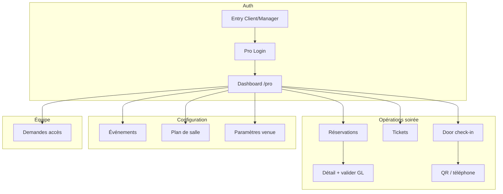

# Critique UX/UI & Features — Layali Manager (prototype)

> **Date :** 15 juin 2026  
> **URL testée :** `http://localhost:5173/`  
> **Périmètre :** espace manager (`ManagerScreens.tsx`, navigation pro dans `App.tsx`)  
> **Référence spec :** `aispecs/apps/layali/navigation.md`, écrans `screens/pro/*`

---

## Synthèse

| Critère | Note | Commentaire |
|---------|------|-------------|
| Parcours auth & entrée | 6/10 | Choix client/manager clair, mais bugs de routing login |
| Dashboard opérationnel | 5/10 | KPIs basiques utiles, loin de la spec pro |
| Gestion réservations | 5/10 | Liste + filtres statut OK, pas de détail ni actions |
| Équipe / accès | 7/10 | Meilleur écran : liste, détail, approve/reject |
| Door check-in | 4/10 | QR mock fonctionne ; téléphone et caméra absents |
| Cohérence visuelle Layali | 4/10 | Styles manager sur tokens Vite par défaut, pas `--layali-*` |
| Couverture features vs spec | 3/10 | 4 écrans sur ~12 routes pro prévues |

**Verdict :** bon squelette pour démo « jour J manager », mais **non prêt pour un test terrain** (porte, validation guest list, CA). Prioriser les bugs de navigation et le check-in avant d’ajouter des écrans.

---

## Parcours testés (automatisé + revue code)

| # | Flow | Chemin | Statut |
|---|------|--------|--------|
| M0 | Entrée app | `entry` → choix Client / Manager | OK |
| M1 | Login manager | Manager → Je suis manager → submit | OK (mock) |
| M2 | Dashboard | KPIs + aperçu résas + actions rapides | OK |
| M3 | Demandes équipe | Liste → détail → Approuver | OK |
| M4 | Réservations pro | Liste + filtres CONFIRMED/PENDING/… | OK |
| M5 | Contrôle entrée | Paste référence `LAY-ABC123` | Partiel |
| M6 | Nav « Tableau de bord » | 1er onglet bottom nav | **Bug** |
| M7 | Logout | Onglet Logout | OK → feed client |
| M8 | Login « client » via pro-login | Je suis client → submit | **Bug** |

Commande de parcours :

```bash
cd layali/mobile
node scripts/manager-flow-walkthrough.mjs http://localhost:5173
```

---

## Ce qui fonctionne bien

### Double entrée Client / Manager

L’écran `entry` et le `ProLoginScreen` respectent la spec : deux profils explicites avant authentification.

### Dashboard « ce soir » lisible

4 KPIs (Arrivés, Confirmés, Total, Demandes équipe) + extrait des réservations du jour donnent une vision rapide pour un OWNER un vendredi soir.

### Demandes d’accès équipe

- Liste groupée En attente / Traitées  
- Détail avec rôle demandé, message, date  
- Actions Approuver / Rejeter avec mise à jour d’état locale  

C’est l’écran le plus complet du module pro.

### Liste réservations pro

- Filtres par statut avec compteurs  
- Infos client (nom, téléphone, référence, min spend)  
- Aligné partiellement avec `pro-bookings-list.screen.md`

### Navigation manager dédiée

Bottom nav adaptée : Équipe, Resas, Entrée, Logout — logique métier compréhensible.

---

## Bugs critiques (priorité haute)

### 1. « Tableau de bord » renvoie vers le feed client

Le premier onglet en mode manager affiche « Tableau de bord » mais appelle `navigate('home')` au lieu de `pro-dashboard`.

**Impact :** le manager quitte son espace et atterrit sur le feed client (`Trouver votre accès ce soir`) tout en restant `isManagerMode: true` — nav hybride incohérente.

**Fix :** `onClick={() => navigate('pro-dashboard')}` et `is-active` sur `currentScreen === 'pro-dashboard'`.

---

### 2. Login « Je suis client » sur `ProLoginScreen` connecte en manager

`handleManagerLogin` appelle toujours `loginManager()` même si `audience === 'customer'`.

**Impact :** parcours auth cassé ; un client qui passe par Manager → Je suis client se retrouve OWNER sur Sky 31.

**Fix :** si `audience === 'customer'`, rediriger vers `login` client ou appeler un `loginCustomer()` distinct.

---

### 3. Recherche téléphone au check-in ne affiche pas le résultat

```typescript
onClick={() => {
  const booking = getBookingByPhone(searchPhone)
  if (booking) setSearchPhone('')  // efface le champ uniquement
}}
```

**Impact :** le fallback téléphone (spec door-checkin) est **non fonctionnel** — seul le paste QR/référence marche.

**Fix :** `setScannedQR(booking.reference)` ou état `matchedBooking` dédié ; afficher le panneau vert/rouge comme pour le QR.

---

### 4. « Enregistrer l’arrivée » ne change pas le statut

Le CTA reset l’écran sans passer la résa en `ARRIVED` ni appeler une API mock.

**Impact :** les KPI « Arrivés » ne se mettent jamais à jour depuis le check-in.

---

## Problèmes UX/UI (priorité moyenne)

### 5. Identité visuelle déconnectée du client

Les styles manager vivent dans `App.css` avec variables génériques (`--accent`, `--bg-secondary`, `--text-secondary`) **non définies** dans `tokens.css` Layali.

**Impact :** KPIs et cartes peuvent paraître « template Vite » plutôt que Layali Majorelle ; rupture entre port 5173 (manager) et 5174 (client) si deux instances.

**Fix :** réutiliser `--layali-*` et composants surface/border du client.

---

### 6. Copy et langue incohérentes

| Zone | Problème |
|------|----------|
| Statuts résa | `CONFIRMED`, `PENDING`, `ARRIVED` en EN |
| Rôles | `OWNER`, `HOST`, `BAR_MANAGER` bruts |
| Nav | `Equipe`, `Resas`, `Entree`, `Logout` sans accents / mix FR-EN |
| Demandes équipe | `EN ATTENTE` en majuscules |

**Fix :** libellés FR (`Confirmée`, `En attente`, `Arrivé`, `Équipe`, `Déconnexion`).

---

### 7. Pas de layout `pro-shell` / sidebar

La spec prévoit sidebar desktop (Tableau de bord, Événements, Plan de salle, Tickets, Door, Avis, Paramètres). Le prototype mobile n’a que 4 onglets — acceptable pour mobile, mais **aucune route** vers événements, tables, tickets, avis, settings.

---

### 8. Dashboard sans lien KPI → action

Les KPIs ne sont pas cliquables (spec : KPI tables → `/pro/tables`, tickets → `/pro/tickets`).

Pas de graphique ventes, pas de feed live, pas de sélecteur multi-venue.

---

### 9. Réservations : pas de détail ni actions métier

Manquent par rapport à la spec :

- Écran détail réservation (`pro-booking-detail`)
- Valider / refuser une guest list `PENDING`
- Marquer no-show, annuler, rembourser
- Recherche par nom / téléphone / référence
- Filtres mode d’accès, occasion, date

Les cartes ne sont pas cliquables.

---

### 10. Door check-in loin de la spec fullscreen

| Spec | Prototype |
|------|-----------|
| Layout fullscreen, sans chrome | Header + bottom nav visibles |
| Scanner caméra + viewfinder | Emoji 📱 + input texte |
| Compteur entrées / capacité | Absent |
| Wake lock | Absent |
| Mode offline + queue | Absent |
| Feedback vert/rouge immédiat | Partiel (succès seulement si QR match) |
| Rôles HOST en priorité | Pas de redirect HOST → door |

---

### 11. Doublon choix audience

`entry` → Manager → `pro-login` → **re-choix** Je suis client / Je suis manager.

**Impact :** friction inutile (2 clics de trop pour un manager qui a déjà choisi Manager à l’entrée).

**Fix :** passer `audience=manager` depuis `entry` et afficher directement le formulaire.

---

### 12. Accessibilité

- Cartes `.request-card` en `<article onClick>` sans rôle bouton
- Emojis comme seules icônes nav (👥 📋 🚪)
- Pas de feedback aria sur approve/reject
- Check-in : pas d’annonce lecteur d’écran succès/échec

---

## Gap features — Spec vs prototype

### Écrans pro spec (`navigation.md` §6.2)

| Route spec | Écran | Prototype |
|------------|-------|-----------|
| `/pro` | Tableau de bord | `pro-dashboard` — partiel |
| `/pro/access-requests` | Accès équipe | `pro-access-requests` — OK |
| `/pro/events` | Événements | **Absent** |
| `/pro/tables` | Plan de salle | **Absent** |
| `/pro/bookings` | Réservations | `pro-bookings-list` — partiel |
| `/pro/bookings/:id` | Détail résa | **Absent** |
| `/pro/tickets` | Tickets vendus | **Absent** |
| `/pro/door` | Check-in | `pro-door-checkin` — mock |
| `/pro/reviews` | Avis | **Absent** |
| `/pro/venue` | Paramètres lieu | **Absent** |
| `/pro/request-access` | Demande accès | **Absent** |
| `/pro/no-access` | Sans droits | **Absent** |

### Features métier manquantes (jour J)

1. **Valider guest list** depuis la liste réservations (Youssef Zaki `PENDING`)
2. **CA / ventes tickets** du soir
3. **Configurer une soirée** (capacité, modes d’accès, fermeture billetterie)
4. **Plan de tables** (occupation temps réel)
5. **Notifications** nouvelle résa / alerte capacité 90 %
6. **Multi-rôles** : vue HOST limitée à Door, BAR_MANAGER lecture seule
7. **Tenant suspendu / no-access** guards

---

## Parcours cible (spec)



**Prototype actuel :** auth → dashboard → AR, B (liste), DR (partiel). Branches config et détail résa absentes.

---

## Recommandations priorisées

### Sprint M1 — Bugs bloquants (1 jour)

1. Fix nav Tableau de bord → `pro-dashboard`
2. Fix login client sur `ProLoginScreen`
3. Fix recherche téléphone + enregistrement arrivée (statut `ARRIVED`)
4. Sauter le double choix audience quand on vient de `entry` Manager
5. Franciser statuts et nav manager

### Sprint M2 — UX cohérence (2 jours)

6. Migrer styles manager vers `--layali-*`
7. Actif correct sur onglet dashboard
8. Cartes résa cliquables → écran détail mock
9. Action « Valider / Refuser » sur résa `PENDING` (guest list)
10. Masquer bottom nav sur door check-in (mode fullscreen)

### Sprint M3 — Features spec (1–2 semaines)

11. Écran détail réservation complet
12. Liste tickets + KPI CA
13. Scanner caméra (ou lib QR) + compteur entrées
14. Événements liste + édition basique
15. Guards rôles (HOST → door only)
16. Sidebar / menu pour routes manquantes (même en placeholders)

---

## Fichiers concernés

| Fichier | Rôle |
|---------|------|
| `src/ManagerScreens.tsx` | Tous les écrans pro |
| `src/App.tsx` | Entry, routing, bottom nav manager, session |
| `src/App.css` | Styles manager (tokens à aligner) |
| `src/brand/tokens.css` | Design tokens Layali |
| `scripts/manager-flow-walkthrough.mjs` | Parcours automatisé |
| `aispecs/apps/layali/screens/pro/*.md` | Specs de référence |

---

## Liens

- Revue client (round 1 & 2) : [`ux-ui-review.md`](./ux-ui-review.md)
- Navigation spec : [`aispecs/apps/layali/navigation.md`](../../aispecs/apps/layali/navigation.md)
