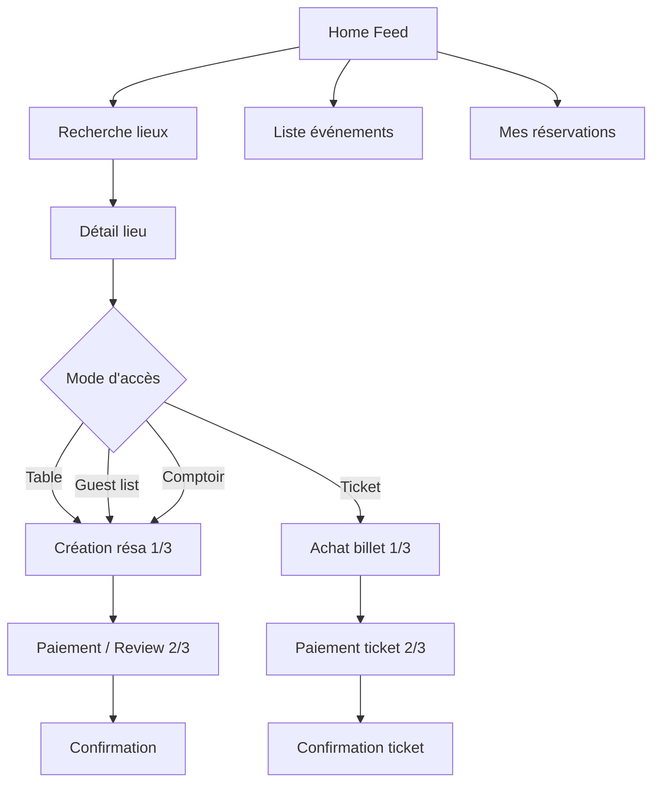

# Critique UX/UI — Layali Mobile (prototype)

> **Date :** 15 juin 2026  
> **Périmètre :** prototype Ionic React (`layali/mobile`), palette C Majorelle & terre cuite  
> **Référence code :** `src/App.tsx`, `src/index.css`, `src/brand/tokens.css`

---

## Synthèse

| Critère | Note | Commentaire |
|---------|------|-------------|
| Identité visuelle | 8/10 | Palette cohérente, ambiance Layali réussie |
| Architecture info | 7/10 | Flows complets, home trop dense |
| Clarté copy | 4/10 | Mélange FR/EN + jargon technique |
| Conversion | 6/10 | Bon stepper, nav parasite + CTA multiples |
| Confiance / premium | 5/10 | Placeholders emoji, éléments morts |
| Accessibilité | 5/10 | Bases présentes, gaps importants |

**Verdict :** le prototype démontre bien la complexité métier (multi-modes d’accès, hybrid ticket+table, approval manuelle). Pour une beta utilisateur, prioriser l’uniformisation linguistique, la simplification de la home et le masquage de la nav pendant les conversions.

---

## Ce qui fonctionne bien

### Identité visuelle cohérente

La palette C (Majorelle `#1E4D8C` + terre cuite `#C45C3E`) sur fond crème riad est bien appliquée via les tokens CSS. L’ambiance « nuit marocaine accessible » ressort dans les hero cards, le gradient CTA et les cartes venue.

### Architecture produit solide

Les 4 modes d’accès (Table, Guest list, Comptoir, Ticket) sont présents sur home, recherche, détail lieu et événement — aligné avec le cœur métier Layali.

### Parcours de conversion structuré

- Stepper 1/3 → 2/3 → confirmation
- Sticky CTA en bas des écrans transactionnels
- Timer de rétention (« 15 minutes »)
- Récap avant paiement

Bonnes pratiques e-commerce adaptées à la nightlife.

### Mobile-first

Conteneur `max-width: 430px`, bottom nav flottante, rails horizontaux — layout pensé smartphone.

---

## Problèmes critiques (priorité haute)

### 1. Mélange FR / EN

La spec brand indique `language: fr`, mais l’interface est très mixte :

| Zone | Exemple actuel |
|------|----------------|
| Home FR | « Trouver votre accès ce soir » |
| Home EN | « Tonight pulse », « Access modes », « See all », « Venue picks » |
| Booking EN | « Reserve a table », « Continue », « Payment » |
| Booking FR | « Demander une guest list », « Mes réservations » |
| Nav EN | Feed, Access, Events, Bookings, Profile |
| Statuts EN | `confirmed`, `pending` sur les badges |

**Impact :** l’app paraît inachevée et brouille la confiance, surtout pour un public marocain francophone.

**Recommandations :**

- Unifier en français (ou i18n dès maintenant avec clés).
- Exemples de traduction :
  - « Tonight pulse » → « Ce soir à Casablanca »
  - « Access modes » → « Modes d’accès »
  - « See all » → « Tout voir »
  - « Venue picks » → « Lieux à découvrir »
  - Nav : « Accueil · Lieux · Soirées · Réservations · Profil »
  - Statuts : « Confirmé », « En attente », « Annulé »

---

### 2. Surcharge cognitive sur la home

La page d’accueil empile **7 sections** avant le CTA final :

1. Hero + recherche
2. Chips filtres
3. Tonight pulse (3 hero cards)
4. Access modes (4 cartes)
5. Venue picks (3 lieux × jusqu’à 4 boutons chacun)
6. Live activity
7. CTA band

Chaque carte venue expose jusqu’à **4 mini-actions** (Table, Guest list, Comptoir, Soirée) en plus du clic sur la carte entière.

**Impact :** paralysie du choix — l’utilisateur ne sait pas par où commencer un samedi soir à 21h.

**Recommandations :**

- Réduire la home à **3 blocs** : recherche + 1 hero « ce soir » + liste venues simplifiée.
- Sur les cartes venue : **1 CTA principal** (« Voir le lieu ») + badge du mode le plus pertinent (« Guest list dispo »).
- Déplacer « Live activity » en second plan ou en notification push.

---

### 3. Bottom nav pendant les flows de conversion

La barre de navigation reste visible pendant réservation, paiement et confirmation.

**Impact :**

- Risque d’abandon involontaire (tap sur « Events » en plein paiement).
- Zone d’écran réduite : chevauchement sticky CTA (`bottom: 54px`) + bottom nav.

**Recommandations :**

- **Masquer la bottom nav** dès `booking-create`, `ticket-buy`, `login`, `register`.
- Ajouter un fil d’Ariane : `Aether Rooftop › Table › Paiement`.
- Gérer `env(safe-area-inset-bottom)` pour iPhone.

---

### 4. Jargon technique exposé à l’utilisateur

Sur le détail lieu, section « Tonight access » :

```
Guest list approval: MANUAL
Counter setup: Named zones
Door fallback: Lookup by phone available
```

**Impact :** ressemble à de la config backend, pas à une promesse utilisateur.

**Recommandations — reformuler en bénéfices :**

| Actuel | Proposé |
|--------|---------|
| Guest list approval: MANUAL | Validation manuelle sous 30 min |
| Counter setup: Named zones | Places au bar par zone |
| Door fallback: Lookup by phone available | Entrée possible avec votre numéro de téléphone |

---

## Problèmes moyens (priorité moyenne)

### 5. Éléments non interactifs ou « morts »

| Élément | Problème |
|---------|----------|
| Chips filtres home | `IonChip` sans `onClick` — visuellement actifs, inertes |
| Recherche home | `readOnly` + redirect — l’utilisateur ne peut pas taper |
| « Refresh » Live activity | Bouton sans action |
| Tabs « À venir / Passées » | Pas de changement d’état |
| Boutons paiement Stripe/CMI | Pas d’état sélectionné |
| Timer 15 min | Statique, pas de countdown |

**Recommandation :** rendre interactif ou retirer du prototype pour ne pas créer de fausses attentes.

---

### 6. Bottom nav sans icônes

5 onglets en texte seul (`0.74rem`) — difficile à scanner en bas d’écran, surtout en sortie (lumière faible).

**Recommandations :**

- Icônes Ionic : `home`, `location`, `calendar`, `ticket`, `person` + label court.
- Renommer « Access » en **« Lieux »** — plus clair pour l’utilisateur final.

---

### 7. Absence de visuels

Placeholders emoji (`📸`, `🎶`, `🎤`) partout. Pour une app de sorties, **la photo du lieu/l’artiste est le premier critère de décision**.

**Recommandations :**

- Images hero en ratio 16:9 avec overlay gradient.
- Poster événement plein écran sur le détail.
- Même des photos placeholder (Unsplash) améliorent la perception premium.

---

### 8. Hiérarchie visuelle des CTA incohérente

Mélange de `IonButton`, `secondary-btn`, `mini-actions button`, `detail-btn` — importance visuelle variable.

Exemple détail lieu :

- « Reserve a table » → IonButton (primaire)
- « Demander une guest list » → secondary-btn (moins visible)

Alors que pour un club, la guest list peut être le flux principal.

**Recommandation :** **1 CTA primaire** par écran basé sur le mode featured du lieu (`featuredAction` dans les données), les autres en outline.

---

### 9. Accessibilité

**Points positifs :** quelques `aria-label`, structure sémantique partielle.

**Points faibles :**

- Cartes cliquables via `<article onClick>` au lieu de `<button>` ou `<a>` — problème clavier / lecteur d’écran.
- Animations `reveal-up` sans `@media (prefers-reduced-motion: reduce)`.
- Statuts parfois communiqués uniquement par la couleur.
- Touch targets bottom nav à 36px — en dessous des 44px recommandés.

---

## Problèmes mineurs (polish)

| Point | Suggestion |
|-------|------------|
| `<title>prototype</title>` | → « Layali — Votre accès ce soir » |
| `lang="en"` dans HTML | → `lang="fr"` |
| Typo Space Grotesk | Vérifier rendu arabe pour l’option « العربية » du profil |
| Checkbox CGU pré-cochée | Décocher par défaut (éviter dark pattern) |
| Pas de validation formulaire | Bloquer « Continuer » si table non sélectionnée |
| Billets absents de « Mes réservations » | Hub unifié réservations + tickets |
| Profil sans gate login | Afficher login si non connecté, profil si connecté |

---

## Parcours utilisateur



**Point faible :** trop de points d’entrée vers le même objectif (home cards, quick access, search, event detail, venue detail).

---

## Roadmap d’amélioration

### Sprint 1 — Quick wins (1–2 jours)

1. Uniformiser toute la copy en français
2. Masquer bottom nav pendant les flows transactionnels
3. Rendre les chips filtres cliquables ou les retirer
4. Ajouter icônes à la bottom nav
5. Corriger `title` + `lang` HTML

### Sprint 2 — UX core (3–5 jours)

6. Simplifier les cartes venue (1 CTA + badges)
7. Réécrire les policy lists en langage utilisateur
8. États sélectionnés sur moyens de paiement
9. Countdown timer fonctionnel
10. Validation des formulaires avant « Continuer »

### Sprint 3 — Polish premium (1 semaine)

11. Intégrer vraies images lieux / événements
12. Safe area iOS + `prefers-reduced-motion`
13. Hub unifié réservations + billets
14. Gate auth (login vs profil)
15. i18n FR / AR / EN structuré

---

## Fichiers concernés

| Fichier | Rôle |
|---------|------|
| `src/App.tsx` | Écrans, copy, navigation, flows |
| `src/index.css` | Layout, composants UI, bottom nav, sticky CTA |
| `src/brand/tokens.css` | Design tokens palette C |
| `src/prototypeData.ts` | Données mock, labels modes d’accès |
| `index.html` | `title`, `lang` |
| `aispecs/apps/layali/brand.md` | Spec identité visuelle et langue |
| `scripts/flow-walkthrough.mjs` | Parcours automatisé Playwright |

---

# Round 2 — Après implémentation (15 juin 2026)

> Parcours automatisé de **7 flows** via `node scripts/flow-walkthrough.mjs` (Playwright + Edge, viewport 390×844).

## Synthèse round 2

| Critère | Round 1 | Round 2 |
|---------|---------|---------|
| Identité visuelle | 8/10 | 8/10 |
| Architecture info | 7/10 | **8/10** |
| Clarté copy | 4/10 | **7/10** |
| Conversion | 6/10 | **8/10** |
| Confiance / premium | 5/10 | 5/10 |
| Accessibilité | 5/10 | **6/10** |

**Verdict :** prototype nettement plus mature. Flows transactionnels solides. Reste : images réelles, hub réservations+billets, gate auth.

---

## Parcours testés

| # | Flow | Chemin | Statut |
|---|------|--------|--------|
| F1 | Discovery home | Accueil → recherche → carte venue → chips | OK |
| F2 | Table booking | Lieux → Aether → table → paiement → confirm | OK |
| F3 | Mes réservations | Resas → onglets → détail résa | OK (bug corrigé) |
| F4 | Guest list | Mirage → guest list → confirm | OK |
| F5 | Billetterie | Soirées → événement → achat → paiement → confirm | OK |
| F6 | Comptoir | Palmeraie → comptoir → confirm | OK |
| F7 | Auth / profil | Profil → déconnexion → login → register | OK |

---

## Recommandations round 1 — bilan d'implémentation

| Recommandation | Statut |
|----------------|--------|
| Francisation globale | Partiel → **en cours** (reste accents `à`/`é` dans titres) |
| Home simplifiée | **Fait** |
| Nav masquée en conversion | **Fait** |
| Icônes bottom nav | **Fait** |
| Filtres cliquables home/lieux | **Fait** (UI ; pas de filtrage données) |
| Policy lists user-friendly | **Fait** |
| Timer countdown booking | **Fait** |
| Validation formulaire | **Fait** |
| CGU non pré-cochées | **Fait** |
| Fil d'Ariane booking | **Fait** |
| Onglets réservations | **Fait** |
| Paiement sélectionnable | **Fait** |
| Safe area iOS | **Fait** |
| Reduced motion | **Fait** |
| Images réelles | **Non** |
| Hub billets + résas | **Non** |
| Gate auth profil | **Non** |
| Sticky CTA vs bottom nav | **Corrigé** (round 2) |
| Timer billet countdown | **Corrigé** (round 2) |
| Filtres événements interactifs | **Corrigé** (round 2) |
| Copy EN résiduelle | **Corrigé** (round 2) |

---

## Bug corrigé — overlap sticky CTA / bottom nav

**Symptôme :** sur Détail réservation (et autres écrans avec sticky CTA + nav visible), le bouton « Retour aux réservations » était **incliquable** — la bottom nav interceptait les clics (`z-index: 100` vs `10`, même position verticale).

**Fix appliqué** (`index.css`) :

```css
.ion-page:has(.bottom-nav) .sticky-cta {
  bottom: calc(76px + env(safe-area-inset-bottom, 0px));
  z-index: 99;
}

.ion-page:has(.bottom-nav) .screen-container {
  padding-bottom: calc(188px + env(safe-area-inset-bottom, 0px));
}
```

---

## Problèmes restants (round 3)

### Priorité haute

1. **Images réelles** — placeholders emoji (`📸`, `🎶`) ; impact direct sur perception premium nightlife.
2. **Hub unifié** — billets absents de « Mes réservations ».
3. **Gate auth** — profil accessible sans connexion (mock user OT).

### Priorité moyenne

4. **Filtres cosmétiques** — chips home/lieux/événements changent l'état visuel mais ne filtrent pas les données.
5. **Accents FR** — titres sans accent (`Ce soir a Casablanca`, `Resas`, `Soirees`).
6. **Hero cards** — non cliquables (pas de navigation vers événement/lieu).
7. **Icônes nav** — unicode (⌂ ⌖) ; migrer vers Ionicon pour cohérence.

### Priorité basse

8. **Avis clients EN** dans `prototypeData.ts`.
9. **Typo arabe** — vérifier rendu Space Grotesk pour option « العربية ».
10. **Deep linking / URL** — navigation par state React uniquement (pas de routes).

---

## Roadmap round 3

### Sprint A — Confiance (2–3 jours)

1. Photos lieux/événements (Unsplash ou assets brand)
2. Hub « Mes accès » (réservations + billets)
3. Gate auth profil

### Sprint B — Finition (2 jours)

4. Filtrage réel des chips (home, lieux, événements)
5. Accents et relecture copy FR complète
6. Ionicon bottom nav

### Sprint C — Production-ready (1 semaine)

7. React Router (URLs partageables)
8. i18n FR / AR / EN
9. Tests E2E CI (`flow-walkthrough.mjs`)

---

## Commande de parcours automatisé

```bash
cd layali/mobile
node scripts/flow-walkthrough.mjs
```

Requiert Playwright (`npm install --no-save playwright --legacy-peer-deps`) et Edge ou Chrome installé localement.

