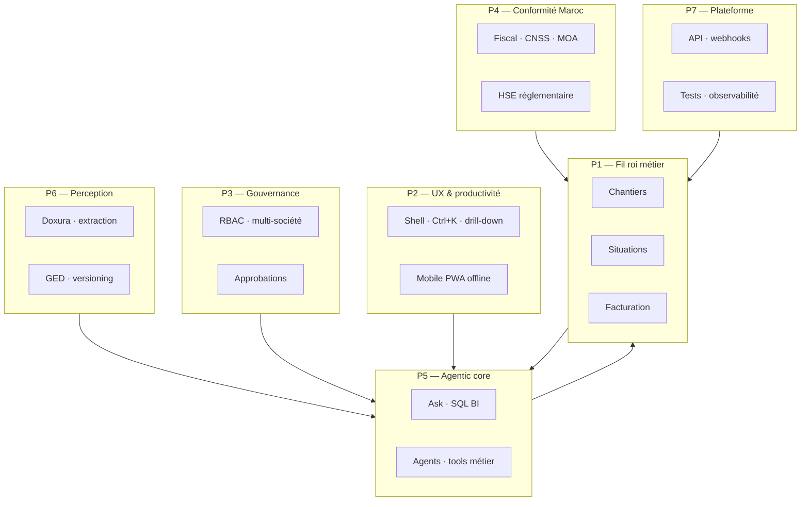

# Nafura Sektor — Roadmap produit : ERP BTP agentique de classe mondiale

> Document maître — vision, phases, epics et critères de succès.
> Dernière mise à jour : 2026-06-18.
>
> **Documents liés :**
> - Exécution court terme : [`BACKLOG.md`](./BACKLOG.md)
> - Extraction documentaire (Doxura) : [`BACKLOG-DOXURA-ERP.md`](./BACKLOG-DOXURA-ERP.md)
> - Audit UX/features : [`UX-FEATURE-AUDIT.md`](./UX-FEATURE-AUDIT.md)
> - Parcours fil roi : [`WALKTHROUGH-CHANTIER.md`](./WALKTHROUGH-CHANTIER.md)
> - Priorités audit R2 : [`specs/erp-audit-round-2-roadmap/00-PRIORITIES.md`](./specs/erp-audit-round-2-roadmap/00-PRIORITIES.md)
> - IA plateforme : [`naf/src/spec/docs/platform-enhancements/16-ai-assistant/`](../../naf/src/spec/docs/platform-enhancements/16-ai-assistant/)
> - SQL assistant : [`rework/specs/10-ai-sql-assistant.md`](../../rework/specs/10-ai-sql-assistant.md)

---

## 1. North Star

**Devenir le premier ERP BTP où l'IA n'est pas un chatbot décoratif, mais un copilote métier intégré à chaque flux** — chantier, achat, stock, marché, finance, terrain — avec garde-fous enterprise (permissions, approbations, audit).

### Promesse produit (3 phrases)

1. **Un conducteur de travaux** crée un chantier, saisit l'avancement sur mobile, génère une situation valorisée et facture le MOA — sans ressaisie.
2. **Un DAF** rapproche BC ↔ BL ↔ facture en un clic, avec l'agent qui propose le lettrage et signale les écarts.
3. **Un DG** demande en langage naturel : « Quels chantiers sont en dérive marge ce trimestre ? » — et obtient une réponse sourcée + lien drill-down.

### Ce qui nous différencie vs Sage / Batigest / Odoo BTP

| Dimension | Concurrents typiques | Sektor cible |
|-----------|---------------------|--------------|
| IA | Absente ou addon générique | **Native, contextuelle, par module** |
| Mobile terrain | Faible / apps séparées | **PWA offline-first, scan, photo, signature** |
| Maroc | Adaptation partielle | **ICE, RAS, CNSS, MOA publics, e-facture DGI** en ADN |
| Fil roi chantier | Modules silotés | **Chantier → situation → facture → tréso** bout-en-bout |
| Documents | Saisie manuelle | **Doxura** (perception) + agents (action) |
| Gouvernance | Rigide | **Workflow approbations + matrice pouvoirs + délégation** |

---

## 2. Modèle de maturité agentique (L0 → L5)

Chaque module ERP progresse sur cette échelle. **Objectif S12 : L3 minimum sur les modules cœur, L4 sur chantiers/finance/achats.**

| Niveau | Nom | Comportement | Exemple BTP |
|--------|-----|--------------|-------------|
| **L0** | Statique | Pas d'IA | CRUD classique |
| **L1** | Aide | Tooltips, aide contextuelle | « Comment créer une situation ? » |
| **L2** | Ask | Chat Q/R sur données + navigation | « Montre-moi les BL du chantier Casa » |
| **L3** | Perceive | Extraction / OCR / import intelligent | Scanner BL → réception préremplie |
| **L4** | Propose | Agent propose actions, humain approuve | « Cette facture correspond au BC-042 — lettrer ? » |
| **L5** | Autonomize | Agents planifiés, seuils, auto sous garde-fous | Relance impayés, alerte marge, réappro auto |

### État actuel par pilier (juin 2026)

| Pilier | Niveau | Constats |
|--------|--------|----------|
| Shell / chat IA | L2 partiel | `ChatPanelService` + tools back (search, navigate, summarize, action, SQL) — UI présente, outils métier peu branchés |
| Doxura (perception) | L3 partiel | 8 doc types seedés ; **1 seule** intégration ERP (BL réceptions) |
| Agent runtime | L2 | `propose → approve → execute` ; outil `noop` + tools génériques |
| SQL BI | L2 | `SqlQueryTool` existe ; schema context generator à industrialiser |
| Fil roi chantier | L1 | Chaîne situation/facture **encore fragile** (lots sans BPU, bugs préremplissage) |
| Mobile terrain | L1 | App Flutter BL ; PWA ERP non offline-first |
| Approbations | L1 | Module présent ; engine workflow incomplet |
| Intégrations MA | L0–L1 | BAM, DGI, CNSS, banques — stubs ou absents |

---

## 3. Les 7 piliers stratégiques



---

## 4. Horizons temporels

| Horizon | Durée | Objectif business | Jalons clés |
|---------|-------|-------------------|-------------|
| **H0 — Stabiliser** | 0–6 sem | Produit démontrable | Fil roi chantier OK ; RBAC ; 5 modules sans 404 |
| **H1 — Vendable** | 2–4 mois | Vente B2B PME BTP Maroc | Mobile terrain ; HSE ; 3-way matching ; fiscal de base |
| **H2 — Agentique** | 4–8 mois | Différenciation IA | L3–L4 sur achats/finance/chantiers ; SQL BI ; agents métier |
| **H3 — Leader** | 8–18 mois | Référence région | Portail fournisseur ; e-facture DGI ; prédictif marge ; écosystème API |

---

## H0 — Stabiliser le socle (semaines 1–6)

> **Règle :** aucune feature IA L4+ tant que le fil roi métier n'est pas vert bout-en-bout.

### H0-A — Fil roi chantier (P0 absolu)

| ID | Epic | Description | Fichiers / modules | Acceptation |
|----|------|-------------|-------------------|-------------|
| H0-A1 | Situations préremplies | Fix NG0203 + `loadLots` en création situation | `situation-detail.page.ts` | Situation CH-2026-004 : L10 = 600k HT |
| H0-A2 | Lots BPU/DPGF | Quantité, unité, PU sur lots (+ import) | `chantier-detail`, `chantier-lot-api` | Avancement → % valorisé → situation ≠ 0 |
| H0-A3 | Marché lié | Création contrat depuis module Marchés | `marches/contrats/*` | Contrat créé + lié sans contournement |
| H0-A4 | Facture → encaissement | Boucler `emettreFacture` → `marquerPayee` | `situation.facade` | Parcours walkthrough 100 % vert |
| H0-A5 | Mouvements stock | Implémenter masterSlave mouvements | `inventory-tx.page.ts` | Réception/sortie multi-lignes persistée |

### H0-B — UX productivité minimum

| ID | Epic | Description | Acceptation |
|----|------|-------------|-------------|
| H0-B1 | Dialogs DS | Remplacer ~18 `window.prompt/confirm` | grep natifs = 0 |
| H0-B2 | Icônes lucide | Défaut `iconLibrary=lucide` + audit | Aucun nom d'icône en texte |
| H0-B3 | Jeu démo | META-1 : tenant peuplé pour audit UX | Walkthrough reproductible |
| H0-B4 | Drill-down universel | Clic ligne → fiche entité | 100 % tables métier cliquables |
| H0-B5 | Command palette | Ctrl+K : routes + entités + actions | 80 % routes indexées |

### H0-C — Gouvernance vendable

| ID | Epic | Description | Acceptation |
|----|------|-------------|-------------|
| H0-C1 | RBAC complet | Rôles BTP (DG, DAF, conducteur, chef chantier) | Permissions effectives par écran |
| H0-C2 | Multi-société | Société switcher + isolation données | 2 sociétés, données étanches |
| H0-C3 | Engine approbations | Workflow générique + inbox | DA > seuil → approbation → exécution |
| H0-C4 | Audit trail | Qui a fait quoi, quand | Timeline sur entités clés |

### H0-D — Qualité & gates

| ID | Epic | Description | Acceptation |
|----|------|-------------|-------------|
| H0-D1 | Tests calcul métier | Situations, RG, TVA, paie | ≥ 75 % services critiques |
| H0-D2 | e2e fil roi | Playwright scénario complet | CI vert |
| H0-D3 | i18n arabe | Parité fr/en/ar modules audités | `i18n:check` 0 erreur |
| H0-D4 | Storybook DS | Stories atomes clés | Build Storybook OK |

**Jalon H0 :** démo client 45 min sans bug bloquant sur fil roi + RBAC + approbation simple.

---

## H1 — ERP BTP vendable Maroc (mois 2–4)

### H1-1 — Chantiers & marchés (métier profond)

| ID | Epic | Niveau IA cible | Description |
|----|------|-----------------|-------------|
| H1-1a | Fiche chantier 8 onglets | L1 | Marché, planning, budget, achats, stock, matériel, RH, docs |
| H1-1b | Import DPGF/BPU | L3 | Excel/PDF → lots (Doxura ou import structuré) |
| H1-1c | Avancements mobile | L2 | Saisie terrain offline + sync |
| H1-1d | Situations auto | L4 | Génération depuis avancements (M-MAR-05) |
| H1-1e | OS + avenants | L3 | Ordres de service, impact délai/montant |
| H1-1f | DGD | L2 | Décompte général définitif automatisé |
| H1-1g | Sous-traitance | L3 | Contrats ST + situations ST |
| H1-1h | Attachements / métrés | L3 | Import quantitatif PDF → attachements |
| H1-1i | Carte chantiers | L1 | Mapbox/Leaflet géoloc chantiers |
| H1-1j | e-signature MOE/MOA | L2 | Signature situations / PV |

### H1-2 — Achats & approvisionnement

| ID | Epic | Niveau IA cible | Description |
|----|------|-----------------|-------------|
| H1-2a | 3-way matching | L4 | BC ↔ BL ↔ facture ; écarts signalés |
| H1-2b | Workflow DA→AO→BC | L2 | Traçabilité complète |
| H1-2c | Scan BC fournisseur | L3 | Doxura `BON_COMMANDE` → commande achat |
| H1-2d | Scoring AO | L4 | Comparatif offres + recommandation agent |
| H1-2e | Fournisseur 360° | L2 | KPI OTIF, encours, attestations |
| H1-2f | Attestations légales | L4 | Alertes expiration CNSS/fiscale/RC |
| H1-2g | Catalogue fournisseur | L2 | Tarifs négociés, BC catalogue |

### H1-3 — Stock & matériel

| ID | Epic | Niveau IA cible | Description |
|----|------|-----------------|-------------|
| H1-3a | Scanner BL | L3 | ✅ Fait — étendre sorties/retours |
| H1-3b | Transferts NDT | L3 | Scan note de transfert |
| H1-3c | Magasin chantier | L2 | Stock par chantier, conso → budget |
| H1-3d | Réservations | L2 | Réserver avant sortie |
| H1-3e | Réappro auto | L4 | Seuils + suggestion commande agent |
| H1-3f | GMAO complète | L2 | Maintenance préventive, OT, carburant |
| H1-3g | Locations engins | L2 | Contrats, échéances, états |
| H1-3h | Tree catégories | L1 | Implémenter treeEditor articles |

### H1-4 — Études & chiffrage

| ID | Epic | Niveau IA cible | Description |
|----|------|-----------------|-------------|
| H1-4a | DPU / déboursé sec | L2 | Calcul marge cible |
| H1-4b | Métré → DPGF → devis | L3 | Chaîne chiffrage |
| H1-4c | Scan devis | L3 | Doxura `DEVIS` → devis + bibliothèque prix |
| H1-4d | Courbe en S | L2 | Prévisionnel vs réalisé |
| H1-4e | Bibliothèque prix | L2 | Versioning, indices BTP01/BTP18 |
| H1-4f | Soumission AO client | L3 | DCE → métré → bordereau → mémoire |

### H1-5 — Finance & fiscal Maroc

| ID | Epic | Niveau IA cible | Description |
|----|------|-----------------|-------------|
| H1-5a | Scan facture FF | L3 | Doxura `SUPPLIER_INVOICE` |
| H1-5b | Lettrage | L4 | Facture ↔ règlement assisté |
| H1-5c | Rapprochement bancaire | L3 | Import relevé + rapprochement |
| H1-5d | Retenue source 5 % | L2 | Calcul + déclaration |
| H1-5e | Caisses chantier | L3 | Avances chef + justificatifs photo |
| H1-5f | Effets LCN/LCR | L2 | Cycle effets de commerce |
| H1-5g | Multi-banques | L2 | Virements XML banques MA |
| H1-5h | Import BAM | L1 | Taux de change officiels |
| H1-5i | ICE/IF/RC partout | L1 | Validation formats, OMPIC autocomplete |

### H1-6 — RH & paie

| ID | Epic | Niveau IA cible | Description |
|----|------|-----------------|-------------|
| H1-6a | Pointage mobile | L3 | Photo, géoloc, signature, offline |
| H1-6b | Heures sup MA | L2 | HS25/50/100 barèmes |
| H1-6c | Congés workflow | L2 | Compteur 1,5 j/mois |
| H1-6d | DAMANCOM / IGR | L2 | Déclarations XML |
| H1-6e | Accidents travail | L2 | DAT CNSS 48h |

### H1-7 — HSE (MOA publics)

| ID | Epic | Niveau IA cible | Description |
|----|------|-----------------|-------------|
| H1-7a | Incidents + NC + CAPA | L2 | Cycle complet |
| H1-7b | PPSPS / PHS / DUER | L2 | Documents réglementaires |
| H1-7c | Inspections + EPI | L2 | PV, dotations, vérifications |
| H1-7d | Visites médicales | L1 | Registre, échéances |
| H1-7e | KPIs HSE | L2 | Tableau de bord conformité |

### H1-8 — Mobile terrain (bloquant usage réel)

| ID | Epic | Niveau IA cible | Description |
|----|------|-----------------|-------------|
| H1-8a | PWA installable | L2 | Lighthouse PWA ≥ 90 |
| H1-8b | Offline IndexedDB | L3 | Avancements, pointage, BL sans réseau |
| H1-8c | Photo géotag | L3 | Chantier journal, incidents |
| H1-8d | QR / scan | L3 | Articles, engins, EPI |
| H1-8e | Signature canvas | L2 | PV, pointage |
| H1-8f | App Flutter sync | L2 | Aligner avec PWA (BL, pointage) |

### H1-9 — Pilotage & analytics

| ID | Epic | Niveau IA cible | Description |
|----|------|-----------------|-------------|
| H1-9a | Données réelles | L2 | Brancher pilotage (plus de squelettes) |
| H1-9b | Graphiques | L2 | `nf-chart` sur 5 tableaux analytics |
| H1-9c | Marges chantier | L2 | Budget vs réalisé vs engagé |
| H1-9d | Cash-flow | L2 | Prévisionnel trésorerie |
| H1-9e | What-if | L4 | Simulateur scénarios agent |

**Jalon H1 :** vente B2B PME/ETI BTP Maroc ; chef chantier utilise l'app sur site ; 3-way matching démo.

---

## H2 — Couche agentique de classe mondiale (mois 4–8)

> **Principe :** chaque agent respecte permissions + tenant + approbations. Jamais d'action destructive sans confirmation.

### H2-0 — Fondation agentic platform

| ID | Epic | Description | Référence |
|----|------|-------------|-----------|
| H2-0a | Chat shell L3 | Panneau contextuel : injecte `entityType`, `entityId`, `route` | `16a-chat-ui.md` |
| H2-0b | Tool registry métier | Enregistrer tools par domaine ERP | `16b-agent-tools.md` |
| H2-0c | SQL BI industrialisé | `generate-ai-schema.mjs` + `SqlQueryTool` durci | `10-ai-sql-assistant.md` |
| H2-0d | Context propagation | `domainKey`, `featureKey`, `resourceKey` sur chaque page | `AI_CONVERSATION_ARCHITECTURE.md` |
| H2-0e | Cost & audit LLM | Tokens, coût, lien conversation ↔ action | `llm-provider` |
| H2-0f | Mode ASK vs AGENT | Bascule explicite ; AGENT = propose/approve/execute | `AgentRuntimeService` |
| H2-0g | Streaming réponses | SSE pour chat (UX) | Nouveau |
| H2-0h | Mémoire session | Historique + résumé long contexte | `ai-conversation` |

### H2-1 — Agents par module (tools métier)

#### Chantiers — Agent « Conducteur »
| Tool | Description | Niveau |
|------|-------------|--------|
| `chantier.get_status` | KPI chantier, avancement, marge | L2 |
| `chantier.list_lots` | Lots, quantités, PU | L2 |
| `chantier.suggest_situation` | Proposer situation depuis avancements | L4 |
| `chantier.alert_delay` | Retard planning vs réel | L4 |
| `chantier.navigate` | Ouvrir fiche, onglet, lot | L2 |

#### Achats — Agent « Approvisionneur »
| Tool | Description | Niveau |
|------|-------------|--------|
| `achat.match_3way` | BC + BL + facture | L4 |
| `achat.compare_devis` | Tableau comparatif AO | L4 |
| `achat.suggest_order` | Réappro depuis seuils stock | L4 |
| `achat.check_attestation` | Validité attestations fournisseur | L4 |
| `achat.create_bc_draft` | Brouillon BC depuis DA approuvée | L4 |

#### Finance — Agent « DAF »
| Tool | Description | Niveau |
|------|-------------|--------|
| `finance.lettrage_suggest` | Propositions lettrage | L4 |
| `finance.rapprochement` | Match relevé ↔ écritures | L4 |
| `finance.relance_impayes` | Rédiger relance client | L4 |
| `finance.cash_forecast` | Trésorerie 90 jours | L4 |
| `finance.scan_invoice` | Wrapper Doxura FF | L3 |

#### Stock — Agent « Magasinier »
| Tool | Description | Niveau |
|------|-------------|--------|
| `stock.scan_bl` | Wrapper Doxura BL | L3 |
| `stock.resolve_article` | Fuzzy match désignation → article | L4 |
| `stock.alert_rupture` | Ruptures + suggestion commande | L4 |
| `stock.valorisation` | État stock valorisé par chantier | L2 |

#### Études — Agent « Économiste »
| Tool | Description | Niveau |
|------|-------------|--------|
| `etude.import_devis` | Doxura DEVIS → devis | L3 |
| `etude.compare_variantes` | Variantes chiffrage | L4 |
| `etude.update_bibliotheque` | Prix unitaires → bibliothèque | L4 |

#### RH — Agent « RH »
| Tool | Description | Niveau |
|------|-------------|--------|
| `rh.pointage_anomaly` | Écarts pointage / planning | L4 |
| `rh.conge_balance` | Solde congés collaborateur | L2 |
| `rh.paie_preview` | Simulation bulletin | L4 |

#### HSE — Agent « QHSE »
| Tool | Description | Niveau |
|------|-------------|--------|
| `hse.incident_report` | Rédiger PV incident depuis photos | L4 |
| `hse.compliance_check` | Échéances réglementaires | L4 |
| `hse.nc_capa_suggest` | Actions correctives suggérées | L4 |

#### Pilotage — Agent « DG »
| Tool | Description | Niveau |
|------|-------------|--------|
| `pilotage.marges_consolidees` | SQL BI multi-chantiers | L2 |
| `pilotage.what_if` | Simulation paramétrique | L4 |
| `pilotage.alert_marge` | Chantiers sous seuil | L5 |
| `pilotage.natural_language` | « Questions business » libres | L2 |

### H2-2 — Perception & documents (Doxura intégré)

| ID | Epic | Description |
|----|------|-------------|
| H2-2a | Service scan partagé | `ErpDocScanService` — voir `BACKLOG-DOXURA-ERP.md` F0-1 |
| H2-2b | 7 doc types branchés | BC, FF, DEVIS, NDT, RECEIPT, packing list |
| H2-2c | GED ↔ extraction | `storedDocumentId` câblé |
| H2-2d | Nouveaux types BTP | DPGF, métré, OS, situation ST, relevé bancaire |
| H2-2e | Email → brouillon | PDF joint → facture/BC brouillon |

### H2-3 — Proactivité (agents planifiés L5)

| ID | Epic | Déclencheur | Action |
|----|------|-------------|--------|
| H2-3a | Alerte marge | Marge < seuil | Notification + résumé agent |
| H2-3b | Alerte caution | J-30 expiration | Workflow renouvellement |
| H2-3c | Alerte attestation | Fournisseur attestation expirée | Bloquer BC optionnel |
| H2-3d | Relance impayés | J+30 facture | Email draft + approbation |
| H2-3e | Réappro stock | Sous seuil min | Brouillon DA |
| H2-3f | Digest quotidien | Cron 8h | Résumé DG : chantiers, tréso, alertes |

### H2-4 — UX agentique

| ID | Epic | Description |
|----|------|-------------|
| H2-4a | Action cards | Boutons « Approuver », « Voir », « Lettrer » dans chat | 
| H2-4b | Inline suggestions | Champs formulaire pré-suggérés par agent |
| H2-4c | Cmd+K IA | « Demander à l'agent » dans palette |
| H2-4d | Voix (option) | Dictée chantier terrain |
| H2-4e | Explicabilité | Chaque réponse agent : sources (IDs, liens) |

**Jalon H2 :** un DAF fait lettrage + rapprochement en langage naturel ; un conducteur génère situation via agent.

---

## H3 — Leadership & écosystème (mois 8–18)

### H3-1 — Intégrations nationales

| ID | Epic | Description |
|----|------|-------------|
| H3-1a | e-facture DGI | QR, signature, archivage 10 ans |
| H3-1b | SIMPL-IS API | TVA mensuelle XML |
| H3-1c | DAMANCOM / CNSS | Télédéclarations paie |
| H3-1d | Open banking MA | Relevés auto AWB/BMCE/CIH/BP |
| H3-1e | OMPIC | Autocomplete ICE/IF/RC |
| H3-1f | Indices BTP | BTP01/BTP18 ANP/HCP |
| H3-1g | WhatsApp Business | Relances, notifications chantier |

### H3-2 — Portails & écosystème

| ID | Epic | Description |
|----|------|-------------|
| H3-2a | Portail fournisseur | AO, dépôt factures, attestations |
| H3-2b | Portail sous-traitant | Situations, documents |
| H3-2c | API publique | REST documentée, rate limit |
| H3-2d | Webhooks | Événements entités métier |
| H3-2e | Migration Sage/Batigest | Import données legacy |
| H3-2f | BIM / IFC (exploratoire) | Lien maquette ↔ métré |

### H3-3 — Intelligence prédictive

| ID | Epic | Description |
|----|------|-------------|
| H3-3a | Prédiction marge finale | ML sur historique chantiers similaires |
| H3-3b | Prédiction délais | Risque retard planning |
| H3-3c | Détection fraude | Écarts BL/facture/prix anormaux |
| H3-3d | Benchmark sectoriel | Anonymisé, opt-in |
| H3-3e | Maintenance prédictive | Engins GMAO |

### H3-4 — Enterprise & scale

| ID | Epic | Description |
|----|------|-------------|
| H3-4a | Multi-groupe | Holdings, consolidation |
| H3-4b | White-label | Marque client |
| H3-4c | SSO enterprise | SAML, AD |
| H3-4d | SLA & observabilité | Datadog, alerting |
| H3-4e | ISO 27001 readiness | Sécurité, pentest |

**Jalon H3 :** référence ERP BTP Afrique du Nord ; écosystème fournisseurs connecté.

---

## 5. Matrice modules × horizons

Légende : ⬜ à faire · 🟡 partiel · ✅ OK · 🤖 agentique

| Module | H0 | H1 | H2 | H3 |
|--------|----|----|----|-----|
| Dashboard | 🟡 | ✅ | 🤖 résumé DG | personnalisation |
| Chantiers | 🟡 fil roi | ✅ 8 onglets | 🤖 conducteur | prédiction marge |
| Situations | 🔴 bugs | ✅ auto | 🤖 suggest | e-sign MOA |
| Achats | 🟡 | ✅ 3-way | 🤖 approvisionneur | portail fourn. |
| Stock | 🟡 | ✅ magasin ch. | 🤖 magasinier | réappro auto |
| Matériel | 🟡 | ✅ GMAO | 🤖 maintenance | prédictif |
| Études | 🟡 | ✅ DPGF | 🤖 économiste | mémoire IA |
| Marchés | 🟡 | ✅ OS/DGD | 🤖 | litige MOA |
| Ventes | 🟡 | ✅ | 🤖 | portail client |
| Finance | 🟡 | ✅ fiscal MA | 🤖 DAF | e-facture DGI |
| RH | 🟡 | ✅ pointage | 🤖 RH | self-service |
| HSE | 🟡 | ✅ MOA | 🤖 QHSE | ISO |
| Pilotage | 🟡 | ✅ données | 🤖 DG + SQL | benchmark |
| Analytics | 🟡 | ✅ graphes | 🤖 NL queries | drill IA |
| Approbations | 🟡 | ✅ engine | 🤖 + délégation | audit hash |
| Admin | 🟡 | ✅ RBAC | API keys | white-label |
| Mobile | 🟡 BL | ✅ PWA offline | 🤖 vocal | push |
| **IA shell** | L2 | L2+ | **L4** | L5 |
| **Doxura** | L3 BL | L3 multi | L4 | email auto |

---

## 6. Architecture agentique cible

```
┌─────────────────────────────────────────────────────────────────────────┐
│  ERP Shell (Angular)                                                     │
│  ┌──────────────┐  ┌──────────────┐  ┌──────────────┐  ┌─────────────┐ │
│  │ Pages métier │  │ Cmd+K        │  │ Chat panel   │  │ Scan (Dox)  │ │
│  │ + context    │  │ + agent      │  │ context-aware│  │ per screen  │ │
│  └──────┬───────┘  └──────┬───────┘  └──────┬───────┘  └──────┬──────┘ │
└─────────┼─────────────────┼─────────────────┼─────────────────┼────────┘
          │                 │                 │                 │
┌─────────▼─────────────────▼─────────────────▼─────────────────▼────────┐
│  Platform AI Layer                                                       │
│  ┌─────────────────┐  ┌──────────────────┐  ┌────────────────────────┐│
│  │ ai-conversation │  │ ai-agent-runtime │  │ doc-extractor (Doxura)   ││
│  │ ASK mode        │  │ propose/approve  │  │ perceive → JSON          ││
│  └────────┬────────┘  └────────┬─────────┘  └───────────┬────────────┘│
│           │                    │                          │             │
│  ┌────────▼────────────────────▼──────────────────────────▼────────────┐│
│  │ AgentToolRegistry                                                    ││
│  │ search · navigate · summarize · action · sql · [métier BTP tools]   ││
│  └────────┬────────────────────────────────────────────────────────────┘│
│           │                                                              │
│  ┌────────▼────────┐  ┌─────────────┐  ┌──────────────┐  ┌───────────┐ │
│  │ llm-provider    │  │ workflow    │  │ permissions  │  │ audit     │ │
│  │ Gemini→multi  │  │ approvals   │  │ RBAC tenant  │  │ trail     │ │
│  └────────────────┘  └─────────────┘  └──────────────┘  └───────────┘ │
└─────────────────────────────────────────────────────────────────────────┘
          │
┌─────────▼──────────────────────────────────────────────────────────────┐
│  ERP Backend (domains) + read-only SQL user (BI) + MinIO (documents)   │
└─────────────────────────────────────────────────────────────────────────┘
```

### Principes non négociables

1. **Humain dans la boucle** — toute écriture métier passe par validation ou approbation workflow.
2. **Permissions = plafond agent** — un agent ne peut pas plus que l'utilisateur.
3. **Explicable** — réponse + sources (IDs entités, requête SQL, extrait doc).
4. **Tenant-safe** — filtre tenant sur SQL, tools, extraction.
5. **Coût maîtrisé** — quotas LLM par tenant/plan ; modèles tierés (rapide vs précis).
6. **Offline-first terrain** — l'agent enrichit, ne bloque pas le métier sans réseau.

---

## 7. KPIs de succès

| KPI | H0 | H1 | H2 | H3 |
|-----|----|----|----|-----|
| Fil roi walkthrough vert | ✅ | ✅ | ✅ | ✅ |
| Modules sans 404 | 13/13 | 13/13 | 13/13 | 13/13 |
| e2e Playwright | 30 | 60 | 100 | 150+ |
| Couverture calcul métier | 75 % | 85 % | 90 % | 95 % |
| PWA Lighthouse | — | 90 | 95 | 100 |
| Pages avec contexte IA | 10 % | 40 % | 80 % | 95 % |
| Actions agent / semaine (pilote) | 0 | — | 500 | 5000 |
| Temps saisie facture FF | — | −50 % | −80 % | −90 % |
| Temps création situation | — | −40 % | −70 % | −85 % |
| NPS conducteur travaux | — | 30 | 50 | 70 |

---

## 8. Ordre d'exécution recommandé (24 semaines)

```
Semaines 1–2   H0-A fil roi (situations, lots BPU, marché, facture)
Semaines 3–4   H0-B/C UX + RBAC + approbations + e2e
Semaines 5–6   H0-D qualité + jalon démo H0

Semaines 7–10  H1-2 achats (3-way) + H1-5 finance (FF, lettrage) + H1-3 stock
Semaines 11–14 H1-1 chantiers profond + H1-8 mobile PWA offline
Semaines 15–16 H1-6 RH pointage + H1-7 HSE + H1-9 pilotage données réelles

Semaines 17–18 H2-0 fondation agentic (context, SQL BI, tools registry)
Semaines 19–20 H2-1 agents finance + achats + chantiers
Semaines 21–22 H2-2 Doxura multi-types + H2-4 UX agentique
Semaines 23–24 H2-3 agents proactifs + jalon H2

→ H3 en streams parallèles (intégrations, portail, prédictif)
```

---

## 9. Anti-patterns

- ❌ **IA avant fil roi** — ne pas vendre l'agent si la situation ne calcule pas.
- ❌ **Chatbot générique** — pas de « How can I help? » sans contexte entité.
- ❌ **Auto-write sans approbation** — interdit sur factures, paie, écritures.
- ❌ **SQL write** — l'agent BI = SELECT only, toujours.
- ❌ **Mock data divergent** — un seul jeu démo (`SEED_CHANTIERS`).
- ❌ **Mobile afterthought** — chaque nouvel écran = responsive + offline checklist.
- ❌ **i18n oublié** — fr/en/ar dès le premier commit.
- ❌ **Dupliquer le pattern BL** — passer par `ErpDocScanService` (H2-2a).

---

## 10. Index des epics → fichiers de travail

| Epic | Fichier backlog détaillé |
|------|--------------------------|
| Fil roi, UX, qualité | [`BACKLOG.md`](./BACKLOG.md) |
| Doxura / extraction | [`BACKLOG-DOXURA-ERP.md`](./BACKLOG-DOXURA-ERP.md) |
| Audit R2 complet | [`specs/erp-audit-round-2-roadmap/00-INDEX.md`](./specs/erp-audit-round-2-roadmap/00-INDEX.md) |
| IA chat UI | `naf/src/spec/docs/platform-enhancements/16-ai-assistant/` |
| SQL BI | `rework/specs/10-ai-sql-assistant.md` |
| Documents GED | `docs/specs/documents/00-overview.md` |
| Lib foundations | `naf/erp/AGENT_SPECS/` |

---

## 11. Template epic (ajouts futurs)

```markdown
### HX-N — [Titre]
- **Pilier :** P1–P7
- **Horizon :** H0 | H1 | H2 | H3
- **Niveau IA :** L0–L5
- **Pourquoi :** [douleur métier, segment client, concurrent]
- **Dépendances :** [HX-M, ...]
- **Fichiers :** [chemins]
- **Agents / tools :** [si applicable]
- **Acceptation :** [critères testables]
- **KPI impact :** [métrique]
```

---

*Ce document est la roadmap produit maître. Pour l'exécution sprint par sprint, dériver des tickets dans `BACKLOG.md` ou créer des epics GitHub/Linear référençant les IDs `H0-A1`, `H1-2a`, `H2-0a`, etc.*
